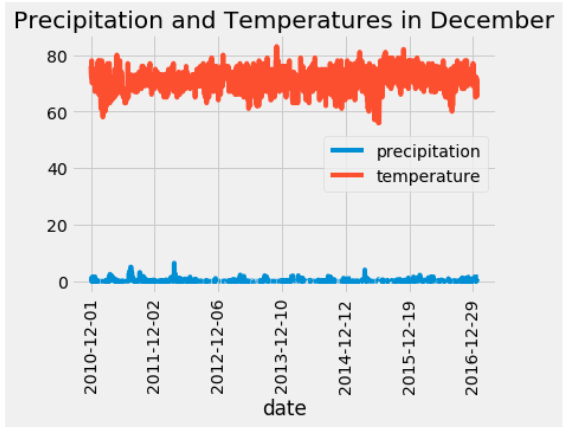

# Climate Analysis

###Challenge 

In the search for ideal weather and location for a surf and ice cream shop in Oahu, it was both important and informational to have temperature data for different stations throughout the island. The results of this analysis were performed on the 'measurement' database available. 

To be taken into consideration for this analysis is determining whether the location for this business is adequate year round. As a preliminary analysis, the months of June and December were queried in the database for both precipitation and temperature. The goal of this is to obtain mean measurements of temperature at minimum to determine whether the appropriate weather is present in Oahu year round. 

To begin, we can look at the temperature and precipitation trends within the month of June across all available years and stations of data. 

Though it is noted that the temperature remains solidly within the 70F-80F range we can solidify our understanding of the data obtained from the June months. A describe() function is used on the resulting dataframe as shown below:

The mean value for precipitation is 0.14in and mean temperature is 74.9F. We can also see that the minimum (or worst case temperature measurement) is 64F. 
We continue our analysis through the evaluation of the same parameters to obtain a December plot for all available years and stations of data available. 

We see a similar trend of temperature data ranging among the temperature trends of 70F-80F with some instances where the temperature decreases to 60F and slightly below. Once again we can apply the describe() function to obtain key statistics on the month of December for all years. 

Comparing the describe() results in both months we see a couple of key differences between the weather statistics in June and December.
Firstly, the mean values in temperature only differ by 4 degrees, considering these are two of the months that would cover both summer and winter market projections. From this standpoint, the values indicate there is very little difference and ice cream sales would be good year round. With that we can also see that the min and max values (64F and 85F for June and 56F and 83F for December) indicate that there is minimal shift in seasons from June to December. 
Since precipitation data was also analysed, we see that not only are there more significant differences in the means (0.17in vs. 0.22in) but that this also accounts for the maximum values which could go up as high as 6.42in in December. 
Lastly, from the statistics data we see that there is also the count of data points that were able to be captured under the describe() function. We see that there are significant differences in the values analyzed for both precipitation and weather and it should be considered whether these could affect the statistics displayed or not. Overall, there is some additional work to be considered but based on the information available there is not much of a swing in temperature when comparing the months of June and December; indicating that ice cream sales would be a productive market year-round. 

Recommendations for refining analysis:

- Thorough analysis accounting for NaN points in the data and how it affects the statistical data. 

- Performing an analysis that takes into account the elevations and how the weather fares in specific sites to determine best location. This would be an analysis focused on the station data available and the ability to recommend a location within the island based on weather trends per station. This could also include heatmaps of stations based on their locations, if available.   
  
  
